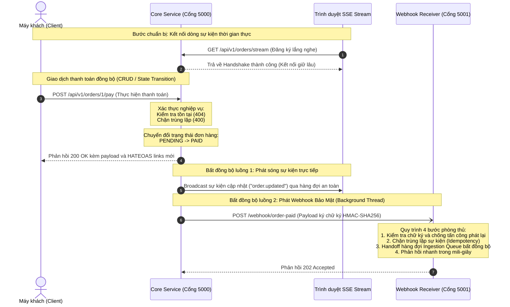

# Hệ Thống Microservices Demo - Hướng Dẫn Kiến Trúc & Kiểm Thử Toàn Diện (Phase 2 & Receiver)

Tài liệu này cung cấp phân tích kiến trúc sâu sắc cho toàn bộ hệ sinh thái microservices demo được xây dựng bằng Python Flask, trình bày các mẫu thiết kế API nâng cao (Advanced API Design Patterns) bao gồm cả hai dịch vụ: **Dịch vụ cốt lõi (`app_core.py` - Cổng 5000)** và **Dịch vụ tiếp nhận Webhook (`app_receiver.py` - Cổng 5001)**. Đồng thời, tài liệu cung cấp hướng dẫn kiểm thử đầu-cuối (End-to-End) chi tiết thông qua các lệnh `curl` trên Terminal.

---

## 1. Phân Tích Kiến Trúc Sâu Sắc & Luồng Giao Tiếp (Architectural & Communication Breakdown)

Trong hệ sinh thái doanh nghiệp thực tế, các dịch vụ không hoạt động cô lập mà giao tiếp chặt chẽ qua các mô hình đồng bộ và bất đồng bộ. Dưới đây là sự kết hợp của 5 mẫu thiết kế API trong hệ sinh thái này:



---

## 2. Chi Tiết Các Mẫu Thiết Kế API Tích Hợp

### A. CRUD Patterns (Read & Update)
* **CRUD Read (`GET /api/v1/orders/<id>`)**: Truy xuất trạng thái đơn hàng thời gian thực với độ phức tạp $O(1)$ từ kho lưu trữ.
* **CRUD Update / Chuyển Đổi Trạng Thái (`POST /api/v1/orders/<id>/pay`)**: Đóng vai trò thực thi máy trạng thái nghiệp vụ (State Machine). Nó thực hiện xác thực đầu vào nghiêm ngặt để đảm bảo đơn hàng tồn tại (trả về `404`) và chưa từng được thanh toán trước đó (trả về `400 Bad Request` bảo vệ double-payment).

### B. Query Patterns (Filtering & Keyset Pagination)
* **Filtering**: Tham số query `?status=<giá_trị>` giúp Client thu hẹp phạm vi tìm kiếm tài nguyên.
* **Keyset Pagination**: Sử dụng con trỏ định danh duy nhất (`starting_after`) kết hợp chỉ số giới hạn trang (`limit`) thay thế cho phân trang truyền thống `OFFSET` có độ phức tạp cao $O(N)$ ở các trang sâu. Keyset pagination đạt độ phức tạp tìm kiếm tối ưu $O(\log N)$ và tránh hiện tượng trùng/bỏ sót bản ghi khi dữ liệu bị biến động ghi liên tục.

### C. HATEOAS Pattern (Hypermedia As The Engine Of Application State)
* Cung cấp đối tượng `_links` phong phú bên trong mỗi bản ghi để dẫn dắt hành động chuyển đổi trạng thái tiếp theo khả thi.
* Tự động phản ánh trạng thái của thực thể: Khi là `PENDING`, API cung cấp hành động `"pay"` (`POST`); sau khi đã chuyển sang `PAID`, hành động này biến mất và được thay bằng hành động `"receipt"` (`GET`).
* Ở mức danh sách bộ sưu tập, API cung cấp liên kết hướng trang `"next"` tự động chứa con trỏ tiếp theo, giúp giảm phụ thuộc cứng (decoupling) giữa Frontend và Backend.

### D. Event-Driven Pattern (Server-Sent Events - SSE)
* Thiết lập một kết nối đẩy đơn hướng (unidirectional stream) thời gian thực sử dụng kiểu nội dung truyền tải tiêu chuẩn `text/event-stream`.
* Sử dụng hàng đợi luồng an toàn `queue.Queue` riêng biệt cho mỗi Client kết nối để cô lập và phân phối sự kiện đồng thời. Định kỳ gửi sự kiện `heartbeat` để tránh rớt kết nối do thiết bị định tuyến trung gian. Tự động thu hồi tài nguyên hàng đợi khi Client ngắt socket (`GeneratorExit`).

### E. Mẫu Phòng Thủ Webhook 4 Bước (4-Step Defensive Webhook Receiver)
Được triển khai chuyên nghiệp bên trong dịch vụ tiếp nhận `app_receiver.py` để bảo vệ hệ thống hạ tầng lõi khỏi các nguy cơ tấn công mạng:
1. **Bước 1 - Xác Thực & Chống Tấn Công Phát Lại (Signature & Replay Protection)**: 
   * Trích xuất chữ ký `X-Webhook-Signature` và timestamp `X-Webhook-Timestamp`.
   * Tính toán lại chữ ký HMAC-SHA256 dựa trên cấu trúc kết hợp `f"{timestamp}.{raw_json}"` kết hợp khóa bí mật dùng chung. Sử dụng hàm `hmac.compare_digest` để triệt tiêu lỗ hổng tấn công rò rỉ thời gian (Timing Attacks).
   * Kiểm tra độ lệch thời gian: Nếu timestamp của yêu cầu lệch quá 5 phút so với thời gian hiện tại của receiver, yêu cầu sẽ bị bác bỏ ngay lập tức để chặn đứng các cuộc tấn công phát lại (Replay Attacks) của tin tặc.
2. **Bước 2 - Kiểm Tra Trùng Lặp Sự Kiện (Idempotency Check)**:
   * Trích xuất thuộc tính định danh duy nhất `event_id` của sự kiện.
   * Tra cứu đối chiếu trong bộ nhớ đệm `PROCESSED_EVENTS` bảo vệ bởi khóa khóa luồng `PROCESSED_LOCK`.
   * Nếu sự kiện đã được xử lý thành công trước đó, ngay lập tức trả về `200 OK` nhưng bỏ qua việc chạy lại logic xử lý nghiệp vụ, đảm bảo tính hội tụ và nhất quán dữ liệu (Idempotency).
3. **Bước 3 - Bàn Giao Hàng Đợi Bất Đồng Bộ (Async Ingestion Queue Handoff)**:
   * Đẩy dữ liệu vào hàng đợi hàng đợi an toàn `INGESTION_QUEUE`. 
   * Giải phóng hoàn toàn luồng xử lý HTTP chính, giúp máy chủ tránh bị nghẽn (Worker starvation) khi gặp phải các tác vụ xử lý hậu kỳ tốn thời gian ở phía sau.
4. **Bước 4 - Phản Hồi Nhanh (Fast Acknowledge)**:
   * Phản hồi trạng thái `202 Accepted` ngay lập tức trong vòng vài mili-giây, thông báo sự kiện đã được lưu giữ an toàn để xử lý ngầm.

---

## 2. Hướng Dẫn Kiểm Thử Đầu-Cuối Toàn Diện (End-to-End Testing Guide)

Để thực hiện kiểm thử trọn vẹn toàn bộ hệ sinh thái luồng đi của dữ liệu, bạn cần mở **3 cửa sổ Terminal** riêng biệt.

### Chuẩn bị: Khởi chạy 2 dịch vụ máy chủ

**Tại Terminal 1**: Khởi chạy dịch vụ cốt lõi (Core Service) chạy trên cổng 5000:
```bash
python app_core.py
```

**Tại Terminal 2**: Khởi chạy dịch vụ tiếp nhận Webhook (Webhook Receiver) chạy trên cổng 5001:
```bash
python app_receiver.py
```

---

### Kịch Bản Kiểm Thử Từng Bước

#### Bước 1: Đăng ký lắng nghe sự kiện thời gian thực (Terminal 3)
Mở **Terminal 3** và thực hiện kết nối vào luồng SSE của dịch vụ cốt lõi:
```bash
curl -N -H "Accept: text/event-stream" http://localhost:5000/api/v1/orders/stream
```
* **Kết quả ngay lập tức trên Terminal 3**:
  ```text
  event: handshake
  data: {"message": "Connected to real-time orders stream"}
  ```
  *(Cứ sau mỗi 5 giây, bạn sẽ thấy các sự kiện tạo đơn hàng ngẫu nhiên `"order_created"` được gửi về từ luồng chạy ngầm).*

---

#### Bước 2: Xem danh sách đơn hàng ban đầu kèm Phân Trang và HATEOAS (Terminal 4)
Mở một **Terminal 4** mới để thực hiện các thao tác gửi yêu cầu API.
Gửi yêu cầu lấy danh sách đơn hàng có giới hạn hiển thị là 2 phần tử:
```bash
curl -i -X GET "http://localhost:5000/api/v1/orders?limit=2"
```
* **Kết quả kỳ vọng trả về trên Terminal 4**:
  * Trả về HTTP `200 OK`.
  * Nhận về đơn hàng ID `1` (trạng thái `PENDING`) và ID `2` (trạng thái `PAID`).
  * Trường `meta` ghi nhận `"has_more": true`.
  * Trường `_links` ở cuối phản hồi tự động tạo liên kết điều phối tiếp theo `"next"` có dạng:
    `"next": {"href": "http://localhost:5000/api/v1/orders?limit=2&starting_after=2", "method": "GET"}`
  * Đơn hàng số `1` (`PENDING`) có chứa liên kết hành động chuyển đổi trạng thái `"pay"` trong khi đơn hàng số `2` (`PAID`) chỉ chứa liên kết `"receipt"`.

---

#### Bước 3: Kích hoạt thanh toán đơn hàng (Kiểm thử dòng chảy dữ liệu liên hoàn - Terminal 4)
Từ **Terminal 4**, gửi yêu cầu thanh toán (`POST`) cho đơn hàng đang chờ là đơn hàng ID `1`:
```bash
curl -i -X POST http://localhost:5000/api/v1/orders/1/pay
```

* **Kết quả kiểm chứng tại các Terminal**:

  1. **Tại Terminal 4 (Màn hình gửi lệnh)**: Nhận phản hồi thanh toán thành công `200 OK` kèm theo liên kết HATEOAS mới được thay đổi:
     ```json
     {
       "message": "Payment successfully processed for order 1.",
       "data": {
         "id": 1,
         "item": "Wireless Mouse",
         "price": 25,
         "status": "PAID",
         "_links": {
           "self": {
             "href": "http://localhost:5000/api/v1/orders/1",
             "method": "GET"
           },
           "receipt": {
             "href": "http://localhost:5000/api/v1/orders/1/receipt",
             "method": "GET"
           }
         }
       }
     }
     ```

  2. **Tại Terminal 3 (SSE Stream)**: Bạn sẽ thấy xuất hiện dòng sự kiện cập nhật trạng thái đơn hàng thời gian thực được đẩy xuống ngay lập tức:
     ```text
     event: order_updated
     data: {"event": "order_updated", "timestamp": 1779344800.123, "data": {"event": "order.updated", "order_id": 1, "status": "PAID"}}
     ```

  3. **Tại Terminal 2 (Webhook Receiver)**: Màn hình log của dịch vụ receiver cổng 5001 sẽ lập tức hiển thị thông điệp tiếp nhận Webhook ký bảo mật HMAC-SHA256 thành công từ máy chủ cổng 5000 gửi qua:
     ```text
     [Webhook Receiver] [Success] Event evt_a1b2c3d4... ingested. Payload Data: {'order_id': 1, 'price': 25}
     ```
     Điều này chứng minh luồng chạy ngầm của dịch vụ core đã ký chữ ký số, tính toán timestamp chống replay attack và gửi Webhook chéo cổng hoàn tất, đồng thời phía Receiver đã giải mã chữ ký, xác thực chống giả mạo, kiểm tra trùng lặp và đưa vào hàng xử lý thành công mỹ mãn trong vòng vài mili-giây!

---

#### Bước 4: Kiểm thử tính Idempotent chặn xử lý trùng lặp trên Receiver (Terminal 4)
Bản chất Webhook của luồng thanh toán đơn hàng ID `1` đã được Receiver cổng 5001 ghi nhận xử lý. Để mô phỏng một sự cố mạng khiến máy chủ core cố gắng gửi lại (retry) cùng một sự kiện Webhook đã thành công, bạn hãy lấy chính xác log của gói tin Webhook và các tiêu đề đã gửi từ Core sang để kiểm tra, hoặc thực hiện kiểm tra kiểm chứng trực tiếp bằng việc giả lập gửi lại Webhook trùng lặp.
Để thực hiện việc này dễ dàng hơn mà không cần chạy lại luồng giao dịch, hệ thống đã ghi nhận `event_id` vào bộ nhớ. Nếu có nỗ lực gửi lại, Receiver sẽ phát hiện trùng ID.

Bạn có thể gửi lại yêu cầu thanh toán đơn hàng `1` một lần nữa để xem phản hồi của máy chủ Core:
```bash
curl -i -X POST http://localhost:5000/api/v1/orders/1/pay
```
* **Kết quả**: Core Service sẽ lập tức trả về `400 Bad Request` kèm theo thông báo đơn hàng đã được thanh toán rồi, ngăn chặn việc kích hoạt chuyển đổi trạng thái hay gửi Webhook trùng lặp vô lý, đảm bảo an toàn tuyệt đối cho hệ thống doanh nghiệp!
